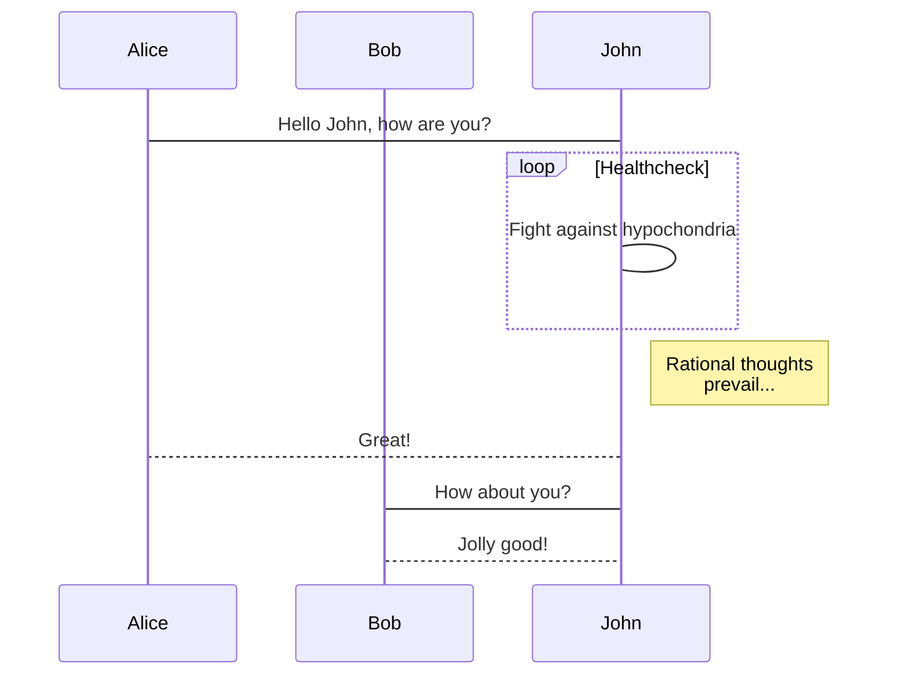
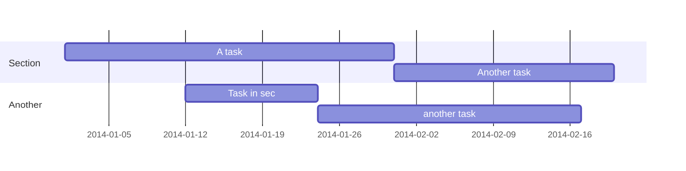

One of my favorite things about R is the plethora of add-ons and extras that can make organizing, editing, and running code easier. Of course, that can come with drawbacks - a friend commented that they didn't like R "because there's always 20 ways to do the same thing!" Of course, that's exactly WHY I like it, so here's a short list of my favorite extras/functions/tips and tricks that will make your life easier. Note that these are all **WINDOWS** shortcuts, Mac OS has different options.

##Finding, Replacing, and Navigating.<br>

Just like in Word, PDFs, or webpages, you can search and locate specific instances of text with **Ctrl-F**. If you already have a piece of text highlighted when you do this, the 'find' will autopopulate with that piece, saving you the trouble of retyping. You can also choose to limit your search to text in the same case, or search by regular expressions. 

Replace comes up in the same 'find' taskbar. If you've highlighted a portion of code, you can easily replace all instances just in that snippet by checking 'in selection' and then then hitting the 'all' button. This can be really handy if you're doing the same set of tasks on many objects with different names and need to be sure you've changed all the named instances.

Another useful way to organize code is using **Ctrl-Shift-M**. This will bring up a dialog box in which you can type the main purpose of the code or part of the document you're working on, like 'Import Data' or 'Run Logistic Regression'. Then, use **Ctrl-PgUp** or **Ctrl-PgDn** to easily navigate directly to previous or later sections.

One more: navigating the cursor to the beginning (**Home**) or end (**End**) of line.

##Selection<br>

To highlight the entire current line: **Ctrl-Shift-L**.
To highlight all code to a matching parenthes or bracket, use **Ctrl-Shift-Alt-E**.
To select all code from current to start/end, use **Ctrl+Shift+Home/End** or **Shift+Alt+Up/Down**	

##Running Code<br>

 To run current line (or whatever is in your highlight snippet), **Ctrl-Enter**. You can also go up to the 'code' tab, then select 'run selected line' but I find it's faster to do via keyboard. To run the whole document up to your current cursor, use **Ctrl-Alt-B**, or from current line to then end use **Ctrl-Alt-E**.


##Commenting<br>
I comment out lines frequently. **Ctrl-Shift-C** will comment out the current line or selection.


##Inserting Helpful Operators<br>
The pipe operator, %>%, is a useful function built in the magittr package. Insert one with **Ctrl-Shift-M**. Also, in R the assignment operator, <- , can be inserted with **Alt- -** (that's alt and the minus key).


These are NOT the only available shortcuts, for a more complete list see this [cheatsheet](https://rstudio.com/wp-content/uploads/2016/01/rstudio-IDE-cheatsheet.pdf) . You can also create/customize your own personal shortcuts by going to 'Tools' --> 'Modify Keyboard Shortcuts'.

Academic supports a Markdown extension for highlighting code syntax. You can enable this feature by toggling the `highlight` option in your `config/_default/params.toml` file.

    ```python
    import pandas as pd
    data = pd.read_csv("data.csv")
    data.head()
    ```

renders as

```python
import pandas as pd
data = pd.read_csv("data.csv")
data.head()
```

### Math

Academic supports a Markdown extension for $\LaTeX$ math. You can enable this feature by toggling the `math` option in your `config/_default/params.toml` file and adding `markup: mmark` to your page front matter.

To render *inline* or *block* math, wrap your LaTeX math with `$$...$$`.

Example **math block**:

```tex
$$\gamma_{n} = \frac{ 
\left | \left (\mathbf x_{n} - \mathbf x_{n-1} \right )^T 
\left [\nabla F (\mathbf x_{n}) - \nabla F (\mathbf x_{n-1}) \right ] \right |}
{\left \|\nabla F(\mathbf{x}_{n}) - \nabla F(\mathbf{x}_{n-1}) \right \|^2}$$
```

renders as

$$\gamma_{n} = \frac{ \left | \left (\mathbf x_{n} - \mathbf x_{n-1} \right )^T \left [\nabla F (\mathbf x_{n}) - \nabla F (\mathbf x_{n-1}) \right ] \right |}{\left \|\nabla F(\mathbf{x}_{n}) - \nabla F(\mathbf{x}_{n-1}) \right \|^2}$$

Example **inline math** `$$\left \|\nabla F(\mathbf{x}_{n}) - \nabla F(\mathbf{x}_{n-1}) \right \|^2$$` renders as $$\left \|\nabla F(\mathbf{x}_{n}) - \nabla F(\mathbf{x}_{n-1}) \right \|^2$$ .

Example **multi-line math** using the `\\` math linebreak:

```tex
$$f(k;p_0^*) = \begin{cases} p_0^* & \text{if }k=1, \\
1-p_0^* & \text {if }k=0.\end{cases}$$
```

renders as

$$f(k;p_0^*) = \begin{cases} p_0^* & \text{if }k=1, \\
1-p_0^* & \text {if }k=0.\end{cases}$$

### Diagrams

Academic supports a Markdown extension for diagrams. You can enable this feature by toggling the `diagram` option in your `config/_default/params.toml` file or by adding `diagram: true` to your page front matter.

An example **flowchart**:

    ```mermaid
    graph TD;
      A-->B;
      A-->C;
      B-->D;
      C-->D;
    ```

renders as


An example **sequence diagram**:

    ```mermaid
    sequenceDiagram
      participant Alice
      participant Bob
      Alice->John: Hello John, how are you?
      loop Healthcheck
          John->John: Fight against hypochondria
      end
      Note right of John: Rational thoughts <br/>prevail...
      John-->Alice: Great!
      John->Bob: How about you?
      Bob-->John: Jolly good!
    ```

renders as



An example **Gantt diagram**:

    ```mermaid
    gantt
      dateFormat  YYYY-MM-DD
      section Section
      A task           :a1, 2014-01-01, 30d
      Another task     :after a1  , 20d
      section Another
      Task in sec      :2014-01-12  , 12d
      another task      : 24d
    ```

renders as



### Todo lists

You can even write your todo lists in Academic too:

```markdown
- [x] Write math example
- [x] Write diagram example
- [ ] Do something else
```

renders as

- [x] Write math example
- [x] Write diagram example
- [ ] Do something else

### Tables

Represent your data in tables:

```markdown
| First Header  | Second Header |
| ------------- | ------------- |
| Content Cell  | Content Cell  |
| Content Cell  | Content Cell  |
```

renders as

| First Header  | Second Header |
| ------------- | ------------- |
| Content Cell  | Content Cell  |
| Content Cell  | Content Cell  |

### Asides

Academic supports a Markdown extension for asides, also referred to as *notices* or *hints*. By prefixing a paragraph with `A>`, it will render as an aside. You can enable this feature by adding `markup: mmark` to your page front matter, or alternatively using the [*Alert* shortcode](https://sourcethemes.com/academic/docs/writing-markdown-latex/#alerts).

```markdown
A> A Markdown aside is useful for displaying notices, hints, or definitions to your readers.
```

renders as

A> A Markdown aside is useful for displaying notices, hints, or definitions to your readers.

### Did you find this page helpful? Consider sharing it 🙌
